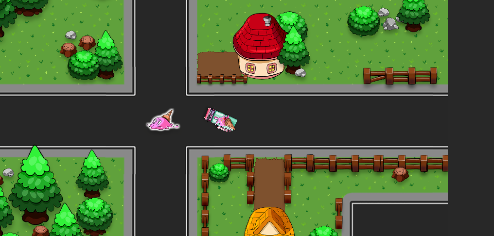
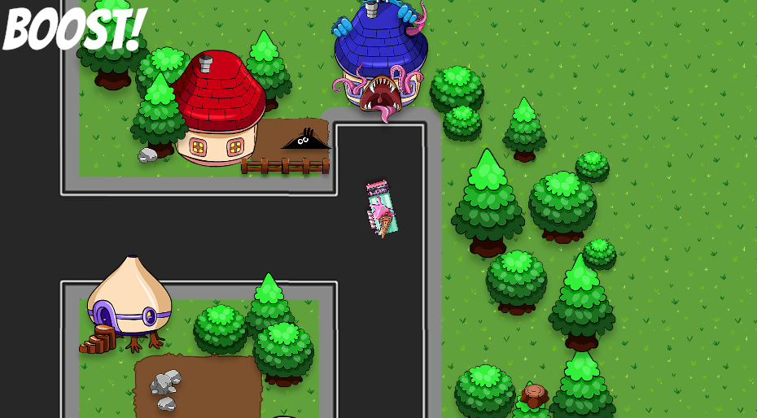
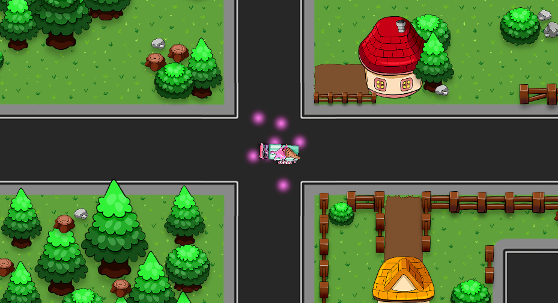

# Delivery Game (Unity 2D)

A small top‑down delivery game about an ice‑cream truck: drive around the city, pick up ice‑cream, and deliver it to customers while managing speed boosts and collisions.

### About this project
This is my first game. I built it by following the GameDev.tv course on Udemy. The goal is simple: drive an ice‑cream truck, collect ice‑cream pickups around the map, and deliver them to customers. It’s a tiny learning project that I’m sharing publicly as a simple example.

## Preview
- Genre: 2D Top‑Down, Arcade, Driving
- Engine: Unity 6 — Editor version `6000.2.8f1`
- Input: Unity Input System (keyboard)
- UI: TextMesh Pro

## How to Play
- Move: W/S (forward/back)
- Steer: A/D (left/right)
- Pickups: Drive through an ice‑cream pickup (package) to collect it
- Deliveries: Drive into a Customer to complete delivery
- Boost: Drive through a Boost pickup to temporarily increase speed
- Collisions: Hitting world obstacles cancels the boost and returns speed to normal

Core scripts:
- `Assets/Scripts/Driver.cs` — movement, steering, boost toggle, collision with world
- `Assets/Scripts/Delivery.cs` — package pickup/delivery logic with simple particle feedback

## Project Setup
This repository intentionally tracks only the essential Unity folders to keep the repo small and clean.

Included in Git:
- `Assets/`
- `Packages/`
- `ProjectSettings/`
- Root docs: `.gitignore`, `.gitattributes`, `README.md`

Ignored (auto‑generated or machine‑local):
- `Library/`, `Temp/`, `Obj/`, `Build/`, `Builds/`, `Logs/`, `UserSettings/`, `.vs/`, `.idea/`, `.gradle/`, `Bee/`, `BurstCache/`

Open the project:
1) Open Unity Hub
2) Add this folder and open with Unity 6 (`6000.2.8f1` or newer minor)
3) Recommended Editor settings (Project Settings → Editor):
   - Version Control: Visible Meta Files
   - Asset Serialization: Force Text

## Controls and Systems
The project uses the new Input System via `UnityEngine.InputSystem` and simple keyboard polling in `Driver.cs`.
- Movement is frame‑rate independent using `Time.deltaTime`
- Steering rotates the car and translate forward/back in local space
- Boost logic enables a temporary speed value and toggles a TMP UI label
- World collisions reset speed back to regular

## Build
Open File → Build Settings… and create a build for your target platform. Builds are ignored by Git.

## Screenshots
Add your images into the `Screenshots/` folder in this repository and they will render on GitHub:





## Credits
- Art/Prefabs: `Assets/GameDev.tv - Delivery Dash Assets/` (from GameDev.tv course assets)
- UI: TextMesh Pro

### Assets note
The visual assets come from the GameDev.tv Delivery Dash course pack and are included here only for learning/showcase purposes with this project. Please check the original provider’s terms if you plan to reuse them outside this repository.

## License
Code is released under the MIT License — see `LICENSE`.
Third‑party art/assets remain under their respective licenses.

## Git Tips (clean pushes)
If you mistakenly staged huge Unity folders before `.gitignore` existed, untrack them and push cleanly:

```powershell
# From the project root
git rm -r --cached "Library" "Temp" "Obj" "Build" "Builds" "Logs" "UserSettings" ".vs" ".idea" ".gradle" "Bee" "BurstCache"
git commit -m "Clean: remove Unity transient folders from tracking"
git push
```

Optional: Use Git LFS for very large binary assets (configured in `.gitattributes`).
